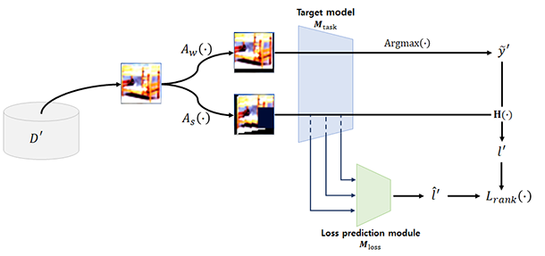

# Enhancing Active Learning with Semi-Supervised Loss Prediction Modules - _Official Pytorch implementation of the IEEE Access, vol.x, 2024_

__*Sekjin Hwang, Jinwoo Choi, Joonsoo Choi*__

Official Pytorch implementation for [the paper](https://ieeexplore.ieee.org/abstract/document/10646351) published on IEEE Access titled "_Enhancing Active Learning with Semi-Supervised Loss Prediction Modules_".

</img>

## Abstract
_In recent years, deep learning techniques have substantially improved across numerous applications. However, these advancements come with the requirement for extensive human-labeled data, leading to high labeling costs. Active learning addresses this issue by reducing labeling costs. The primary goal of active learning is to select the most informative data for model training. Among the various active learning strategies, uncertainty-based methods are most prevalent. These methods focus on data points where the model’s predictions are uncertain, identifying them as key candidates for additional learning. Recently, uncertainty-based methods have been integrated into deep learning, mainly through learning loss-based methods. These methods involve training a loss prediction module to predict learning loss, using the predicted loss as an indicator of uncertainty. While learning loss-based methods generally perform well, they struggle with more challenging tasks. A notable limitation of previous learning loss-based methods is that they use the same labeled data to train the loss prediction module and the task model. However, since the actual data to be predicted is unlabeled, a loss prediction module trained exclusively on labeled data has inherent limitations. In this study, we propose a new training method for the loss prediction module that is robust to unlabeled data. Our approach employs semi-supervised learning techniques to incorporate unlabeled datasets into the training process of the loss prediction module. Experimental results demonstrate that our proposed method effectively trains a robust loss prediction module, achieving state-of-the-art performance across various datasets._

## Prerequisites:   
- Linux ubuntu22.04
- Python 3.6/3.7
- CPU compatible but NVIDIA GPU + CUDA CuDNN is highly recommended.
- pytorch 2.0.0
- cuda 12.0
- Scikit-learn 1.4.2

## Running code
To train the model(s) and evaluate in the paper, run this command:

```train
python main.py
```
Before running the code, you check the settings in config.py 
